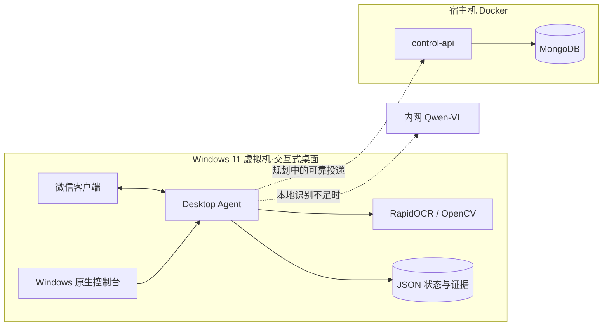
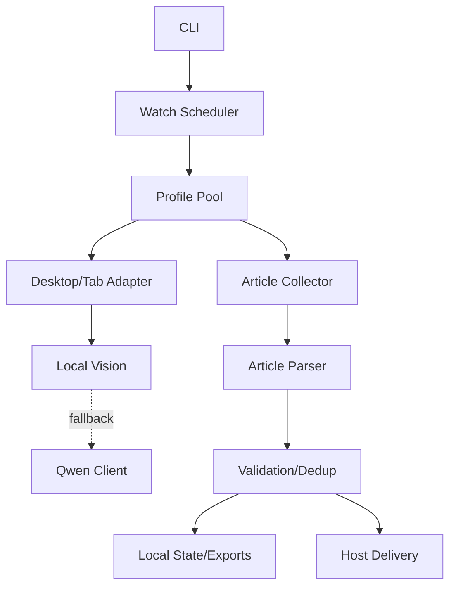

# 微信公众号持续采集系统架构

> 本文描述当前代码结构、运行边界和部署拓扑。微信页面顺序、OCR 闸门、恢复条件和测试预期仍只以 [`docs/WECHAT_SEARCH_COLLECTION_FLOW.md`](docs/WECHAT_SEARCH_COLLECTION_FLOW.md) 为准。

## 1. 架构结论

系统采用“Windows Desktop Agent + 宿主机容器服务”的混合架构：



Desktop Agent 不能放入 Linux Docker：它依赖登录用户会话、微信窗口、屏幕像素、全局键鼠、剪贴板和 Win32 API。容器负责无界面的接收、存储和后续数据服务。

## 2. 当前运行单元

### 2.1 Desktop Agent

运行位置：Windows 11 虚拟机交互式桌面。

当前能力：搜一搜搜索与失焦确认、公众号/服务号资料页识别、十账号资料页池、轮询调度、文章 URL/正文/互动采集、本地状态和可选 MongoDB 写入。

统一命令为：

```powershell
.venv\Scripts\wechat-rpa.exe ...
```

当前运行时位于 `src/wechat_rpa/runtime/collector_runtime.py`，安装环境通过 `wechat-rpa.exe` 启动。根目录不再保留旧采集模块。

### 2.2 Windows 原生控制台

运行位置：与 Desktop Agent 相同的 Windows 用户会话。它负责桌面预检、进程启动、实时日志和需要 Windows API 的管理动作。实际实现位于 `src/wechat_rpa/runtime/control_panel_runtime.py`，通过 `wechat-rpa-control-panel.exe` 启动。

### 2.3 宿主机 control-api

运行位置：Docker。首版接口：

- `GET /health`；
- `GET /api/v1/accounts`；
- `POST /api/v1/articles`；
- `POST /api/v1/agent/heartbeat`；
- `POST /api/v1/runs/events`。

文章接口以规范化微信文章 URL 建立唯一索引，多次投递同一 URL 不会创建重复文章。

### 2.4 MongoDB

主要集合：`collection_target`、`article`、`collection_runs` 和 `agent_heartbeat`。

## 3. 源码目录

```text
src/wechat_rpa/
├── cli/             命令行工具
├── content/         文章网页解析与内容规范化
├── desktop/         Windows/Win11 微信桌面适配
├── vision/          OCR、OpenCV、Qwen-VL
├── scheduler/       资料页池与轮询调度的目标目录
├── storage/         状态、导出、数据库和发件箱的目标目录
├── observability/   日志与指标的目标目录
├── runtime/         当前有效采集器与控制台编排层
├── paths.py         统一项目路径
└── settings.py      环境配置

services/control_api/
├── app.py           容器化宿主机 API
├── requirements.txt
└── static/          现有管理页面静态资源

assets/templates/interaction/   互动指标模板
scripts/windows/                 Windows 脚本实现
deploy/docker/                   Compose、Dockerfile、Mongo 初始化
```

根目录不保留 Python 或 PowerShell 兼容转发文件；批处理启动器直接调用 `scripts/windows/` 与包入口。

## 4. Desktop Agent 内部边界



当前 `runtime/collector_runtime.py` 仍包含多个边界。后续只允许在测试覆盖下逐步迁移，不能重新实现一套并行采集流程。

建议迁移顺序：

1. Win32 窗口、键鼠、截图和剪贴板迁入 `desktop/`；
2. 资料页池、状态文件和时间窗口迁入 `scheduler/`；
3. 文章打开、关闭和校验迁入 `content/`；
4. 本地导出、MongoDB 和可靠发件箱迁入 `storage/`；
5. 最后将 `runtime/collector_runtime.py` 缩减为 CLI 编排层。

## 5. 状态与数据边界

Windows Agent 本地保存：

- `profile-pool-state.json`：资料页池诊断登记；
- `scheduler-state.json`：轮询进度和时间窗口；
- 每账号 `watch-state.json`：已知 URL 和最近轮次；
- OCR 截图、运行日志、JSONL/CSV。

MongoDB 不保存可跨进程直接复用的 HWND、标签序号或屏幕坐标。UI 位置缓存仅适用于相同微信版本、分辨率和 DPI，并且每次使用前必须验证。

## 6. 安全边界

- Desktop Agent 只在可信 Windows VM 运行，不开放 Win32 控制接口到公网。
- control-api 使用 Bearer Token；绑定局域网地址时必须通过防火墙限制来源 VM。
- MongoDB 默认仅绑定宿主机回环地址，容器内部通过专用网络访问。
- `.env`、`.env.mongo`、运行状态、截图和数据库备份不得提交 Git。
- Qwen 无鉴权模式只允许可信内网。

## 7. 容器化边界

可容器化：control-api、MongoDB、后续数据查询/日报/投递 Worker。

不可容器化：微信客户端、Win32 桌面控制、本地屏幕截图和全局键鼠操作。

Compose 文件位于 `deploy/docker/compose.yaml`。Windows 启动器 `mongodb.bat` 会自动使用新位置。

## 8. 当前迁移状态

- 已完成 `src/` 包结构并删除根目录旧模块入口；
- 已完成 OCR、文章解析、Win11 适配、资源和脚本目录迁移；
- 已新增容器化 control-api 与 MongoDB Compose；
- Desktop Agent 主编排和 Windows 控制台位于 `runtime/`，行为保持不变；
- control-api 已具备接收协议，但 Desktop Agent 的 SQLite outbox 与自动 HTTP 投递尚需单独实现和验收。

目录重组后统一使用包命令；不能把“容器启动成功”视为微信采集链路已经完成验收。
